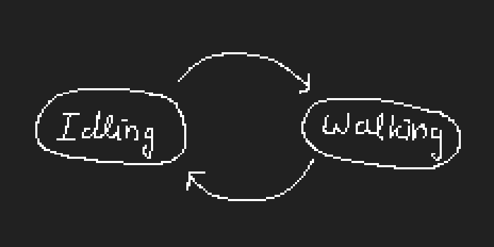

# StateMachine

The `StateMachine` class is intended to be used for, but not limited to, `Character`.

## Setup
The setup is as follows:
  1. Create the StateMachine Node
  2. Make sure it inherits from the `StateMachine.gd` script
  3. Add any possible states as child nodes to the state machine
  4. Make sure these states all have a script that extends the `State.gd` class
  5. Make sure the state is checked as active under the properties if you want it to initially be active
  6. ???

## Code explanations

```gdscript
"""
Base interface for a generic state machine
It handles initializing, setting the machine active or not
delegating _physics_process, _input calls to the State nodes,
and changing the current/active state.
"""
extends Node

signal state_changed(current_state)

"""
This holds all the possible states  
"""
var states_map = {}

"""
This holds a history of the states???
"""
var states_stack = []

"""
This holds the current state the state machine is in
"""
var current_state = null

"""
The state machine can be turned on or off
-> useful for disabling inputs!
"""
export(bool) var active = false setget set_active

func _ready():
  """
  Initialization.
  The initial state will be the first child of the StateMachine node
  """
  states_stack.push_front(get_child(0))
  current_state = states_stack[0]
  if active:
    start()

func start():
  current_state.enter()
  set_active(true)

func set_active(value):
  """
  A setter for setting the state machine active or inactive
  """
  active = value
  set_physics_process(value)
  set_process_input(value)
  if not active:
    states_stack = []
    current_state = null

func _unhandled_input(event):
  """
  Handle the current's sate input if it wasn't handled elsewhere
  """
  current_state.handle_input(event)

func _physics_process(delta):
  """
  Call the current states update function every frame
  """
  current_state.update(delta)

func _on_animation_finished(anim_name):
  """
  We'll see
  """
  if not active:
    return
  current_state._on_animation_finished(anim_name)

func _change_state(state_name):
  """
  Get out of the current state,
  set the new state,
  enter the state
  """
  if not active:
    return
  current_state.exit()

  if state_name == "previous":
    states_stack.pop_front()
  else:
    states_stack[0] = states_map[state_name]

  current_state = states_stack[0]
  emit_signal("state_changed", current_state)
  current_state.enter()
```
